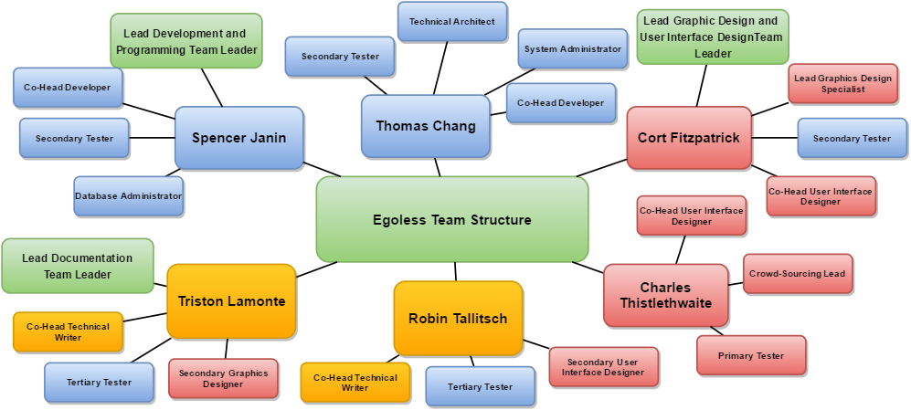
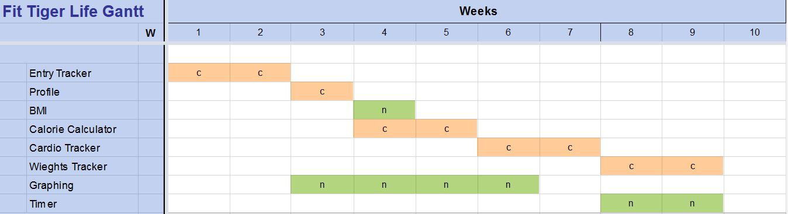

# Project Management Document
## for FitTigerLife
### Version 1.0 approved
### Prepared by *Robin Tallitsch, Triston Lamonte, Thomas Chang, Spencer Janin, Charlie Thistlethwaite, and Cort Fitzpatrick*
### *CSC 4330*
### *12/2/2016*

---

## Revision History 

| Name | Date | Reason for Change | Version |
| :--- | :--- | :--- | :--- |
| Robin Tallitsch, Triston Lamonte | 11/27/2016 | Initial | 1.0 |

---
## Vision
The goal of this application is to tap into the fitness market that has been growing over that past decade. The main draw for this product is that it is self contained and does not require an internet connection. This design is most appropriate for exercising as exercising tend to occur most outside the home. The user interface is also designed to keep interaction to a minimum, so the application can be easily used during exercise.

---
## Process Model
The Iterative and Incremental method is used for development. This allows the programmers to return to previous code to compensate for errors that may occur later on.

---
## Configuration Management
Android Studio and Netbeans were used for the development of the application, while github was used for version control. GroupMe was used to group messages all members and coordinate between members. Google docs were used to work on the project documents, while seeing the changes others make in real time. Once finished on Google Docs, one member configures the markdown file and commit to Github.

---
## Deliverables
The Fit Tiger Life app will be delivered as an ‘.apk’ through the google store for the end user.
The appropriate documents will be stored in the project directory when delivered to stakeholders.

---
## Potential Risks
###### Human Risks
It is possible for a user to be injured exercising while using the Fit Tiger Life app. Though the app is unlikely to be blamed, it would be wise to take legal precautions.

###### Time risk
This project was only given three months to be completed and all our programmers have to balance this project with the course work of several other classes, many of which also require time to work on several projects, in addition to working part time. As such there is a very limited amount of time that can be spent working on this project. To compensate the project has be downscaled and features cut.

###### Resources risk
The main resource issue this application encounters is that to remain offline, a database must be stored locally to the user’s phone. At this point it is not a concern, but as the application scales up, this small issue can grow to be large concern.

---

##### Lead Development and Programming Team:
Spencer Janin, Thomas Chang

##### Graphic Design and User Interface Design Team:
Cort Fitzpatrick, Charles Thistlethwaite

##### Lead Documentation Team:
Triston Lamonte, Robin Tallitsch

###### ~Spencer Janin: Project Manager, Co-Head Developer, Secondary Tester, Database Administrator
Contribution:
My contributions to the project is work developing each android activity in the project. The only android files I did not touch was the GraphView activity that was solely develop by Thomas. I work as the team leader, and issued assignments to group members as well as schedule each meeting. With scheduling meetings, I also reserved a room in middleton for the group to meet in and made sure each member could make the meeting. I was the main project visionary member, and I work with the documentation team to make sure the vision was correct and they had all the information they needed to complete the documents. This meant a lot of design choices were made by me, giving us clear decision making ability. I submitted 5918 lines of code  to the project and removed 559. I put most of the data saving framework to the csv files and first draft UI. I spent a fair amount of time researching the constraints of android as they relate to our project and relaying this information to the team. I gave guidance on the SRS, STD, SDD in the meetings we had. I worked as well with a lot of testing the code and putting in bug fixes for issue we experienced.

###### ~Thomas Chang: Co-Head Developer, Technical Architect, Secondary Tester, System  Administrator
Contribution:
I worked with Spencer on writing the code for the project. My main focus was refactoring the code to minimize the number of lines. I also put together a very simple graphing library that we used in the project and wrote the logic for transforming the data stored in our files into data that could be graphed. I cleaned up a lot of the UI after the first draft was finalized but did not do any design for it. In total, I wrote 4478 lines for the project but I also removed 3604 lines according to GitHub.
  
Meetings Missed:
I missed one meeting on 11/16 for discussing the SRS document because I had a test the next day. Because I missed the meeting, I put together a basic markdown document that would later be used by the technical writers as a template for the actual document.

###### ~Cort Fitzpatrick: Lead Graphics Design Specialist, Co-Head User Interface Designer, Secondary Tester

###### ~Charles Thistlethwaite: Co-Head User Interface Designer, Primary Tester, Crowdsourcing Lead
Towards the beginning of the project I helped conceptualize how the main activities of the app would function, the weight lifting activity was my primary focus.  Throughout the semester, I assisted Robin and Triston in the document meetings.  Lastly, I created the bulk of the presentation’s PowerPoint slides.  I attended all of our groups meetings throughout the semester.

###### ~Triston Lamonte: Co-Head Technical Writer, Tertiary Tester, Secondary Graphics Designer
I worked on every document written for this project. The SRS and this document were evenly worked on by me and Robin. I did the bulk of the work for the STD and Robin did the bulk of the work for the SDD. I was the note taker and record keeper for all the group meetings. I also was the main proprietor of what to test  and suggestions for testing for the STD. For all the document submissions I did final spell and capitalization  checks.

###### ~Robin Tallitsch: Co-Head Technical Writer, Tertiary Tester, Secondary User Interface Designer
Contribution: I worked on every document written for this project. The SRS and this document were evenly worked on by me and Triston. I did the bulk of the work for the SDD and Triston did the bulk of the work for the STD. I also created all the images that were in the previous documents. In addition I reformatted all the Google Docs into Mark Down and committed all the documents to Github.

### Egoless Team Structure

---
## Project Schedule

Pert estimation method:  
Optimistic- 9 weeks  
Most Likely-10 weeks  
Pessimistic- 13 weeks  
Estimation- 10.33 weeks  

---
## 9/19/16 18:00 PM

|Thomas Chang: | Cort Fitzpatrick: | Spencer Janin: | Triston Lamonte: | Robin Tallitsch: | Charles Thistlethwaite: |
| :--- | :--- | :--- | :--- | :--- | :--- |
|✓  |  ✓|✓  | ✓ | ✓ |  ✓ |

Objective: Discuss the roles of each member on the project, decide on what the application is actually going to feature, which features are to be required, and deciding on the team structure.

Outcome: It was decided that Robin and Triston were to be the documentation team, Spencer and Thomas were to be the Development and testing team, and Charles and Cort were to be the Artistic and Outreach team. Features decided on were the Calorie Counter, Exercise Tracking, building graphs based on progress, and a BMI Calculator. Features we decided were optional were a step counter and muscle workout tracking. The group also decided on how the app was going to be made such that it required no network connection as of now, though it may be added in the future, and would store data locally. Names discussed were “Fit Tiger”, “Dat Fitness”, “TigerFit”, and “FitTigerLife”.

## 10/5/16 18:00 PM

|Thomas Chang: | Cort Fitzpatrick: | Spencer Janin: | Triston Lamonte: | Robin Tallitsch: | Charles Thistlethwaite: |
| :--- | :--- | :--- | :--- | :--- | :--- |
|✓  | X |✓  | ✓ | ✓ |  ✓ |

Objective: To discuss the progress made so far on the application by Spencer and Thomas.

Outcome: This was a quick meeting to show off the progress made on the application. The basic framework of a home screen was laid out but most of the buttons shown do nothing. Out of the seven buttons shown only 2 out of the 7 actually went to other screens. Exercise Tracker had fields to input information that yet to work. Features were still getting ironed out as a count-up and a countdown timer were decided on being necessary where one was for cardio and the other for exercise. The name “FitTigerLife” was decided upon.

## 10/19/16 18:00 PM

|Thomas Chang: | Cort Fitzpatrick: | Spencer Janin: | Triston Lamonte: | Robin Tallitsch: | Charles Thistlethwaite: |
| :--- | :--- | :--- | :--- | :--- | :--- |
| X |  ✓|✓  | ✓ | ✓ |  ✓ |

Objective: Collaborative Effort on the SRS document due on the 21st

Outcome: Functional and Non-functional requirements were ironed out. Each step of the SRS document was put through with specific detail. The Development Team were mostly taking in the ideas from the rest of the group, mainly Cort and Charles, into what would be deemed a functional method. There was some conversing on which functions were going to be considered functional and non-functional so priorities were given consideration and from there is where the listing of which were considered nonfunctional came from. The 2nd section of the SRS discussing the overall description of the SRS document was also given a fair amount of time.

## 10/26/16 19:00 PM

|Thomas Chang: | Cort Fitzpatrick: | Spencer Janin: | Triston Lamonte: | Robin Tallitsch: | Charles Thistlethwaite: |
| :--- | :--- | :--- | :--- | :--- | :--- |
|✓  |  ✓|✓  | ✓ | ✓ |  ✓ |

Objective: To show off the advancements made on the project so far, and to give extra roles to those who haven’t had to do too much recently.

Outcome:Spencer used TeamViewer to show the application running from his computer. All the buttons actually had pages behind them, a lot of Android Studio pre-made items were in place as well as the written code. The timer and full functionality from the BMI calculator was shown off. Cardio Tracker and Weights Tracker also each had their own pieces starting to fall into place. There was also some redistribution of priorities given to Charles and Cort to assist the documentation team on the upcoming SDD document. A meeting was scheduled for early the next week.

## 10/31/16 18:00 PM

|Thomas Chang: | Cort Fitzpatrick: | Spencer Janin: | Triston Lamonte: | Robin Tallitsch: | Charles Thistlethwaite: |
| :--- | :--- | :--- | :--- | :--- | :--- |
|✓  |  ✓|✓  | ✓ | ✓ |  ✓ |

Objective: Collaborative effort on the SDD

Outcome: The main architecture and Sus-System Architecture were discussed thoroughly, as well on thorough discussion on how the data was going to be stored locally. It was decided that the data would be stored in CSV data type files. The User Interface was also discussed with the current way the application looked being deemed unsatisfactory. The UI was mostly decided when the SDD came around, mainly dealing with how the home page would look, as well as how the graphs would end up looking. The graphs as of now would only be line graphs.

## 11/14/16 18:30 PM

|Thomas Chang: | Cort Fitzpatrick: | Spencer Janin: | Triston Lamonte: | Robin Tallitsch: | Charles Thistlethwaite: |
| :--- | :--- | :--- | :--- | :--- | :--- |
|✓  |  ✓|✓  | ✓ | ✓ |  ✓ |

Objective: To get everyone on the same page about the STD, when we would be meeting as a group to do the actual testing of the project. To show off the new changes that have about in the actual project.

Outcome: The development team have reworked almost every facet of the application, some for the better, some for the worse. Errors have been popping up a lot with data in fields, or just the function trying to run in general. There was also more discussion on what needed to be added to the application. There’s two branches of the same project on the Github so some of the parts shown are from one branch, some are from the other. A meeting was scheduled two days from this meeting to do the actual testing for the STD. Edit Goal is a mixture of previously deemed functional requirements.

## 11/16/16 18:00 PM

|Thomas Chang: | Cort Fitzpatrick: | Spencer Janin: | Triston Lamonte: | Robin Tallitsch: | Charles Thistlethwaite: |
| :--- | :--- | :--- | :--- | :--- | :--- |
| X |  ✓|✓  | ✓ | ✓ |  ✓ |

Objective: Testing the different operations in preparation of the STD

Outcome: Going through each Function of the app in descending order on the Home screen. Some errors found were that there were null exceptions missing, and that the graphs didn’t work quite right. There were some instances where it was storing null data, it was found out later that it was because the system was storing them as strings and not integers. Cort also brought 30+ graphics he had made for the application forward to show to the team. Functionality was deemed a higher priority at the moment that aesthetics so they were unfortunately put on the backburner.

## 11/27/16 17:00 PM

|Thomas Chang: | Cort Fitzpatrick: | Spencer Janin: | Triston Lamonte: | Robin Tallitsch: | Charles Thistlethwaite: |
| :--- | :--- | :--- | :--- | :--- | :--- |
|✓  |  ✓|✓  | ✓ | ✓ |  ✓ |

Objective: To dictate duties on who would say what in the presentation. Rehearsing for the presentation for the class.

Outcome: There was discussion on whether or not the presentation would include a live showing or a video. Spencer already had a video going through the application that was 4 minutes long so it was struck down in decision to go with images of the working. Collectively we all gave our thoughts on the PowerPoint made so far, and we assisted each other on what each of us should say for our own parts during the presentation.
