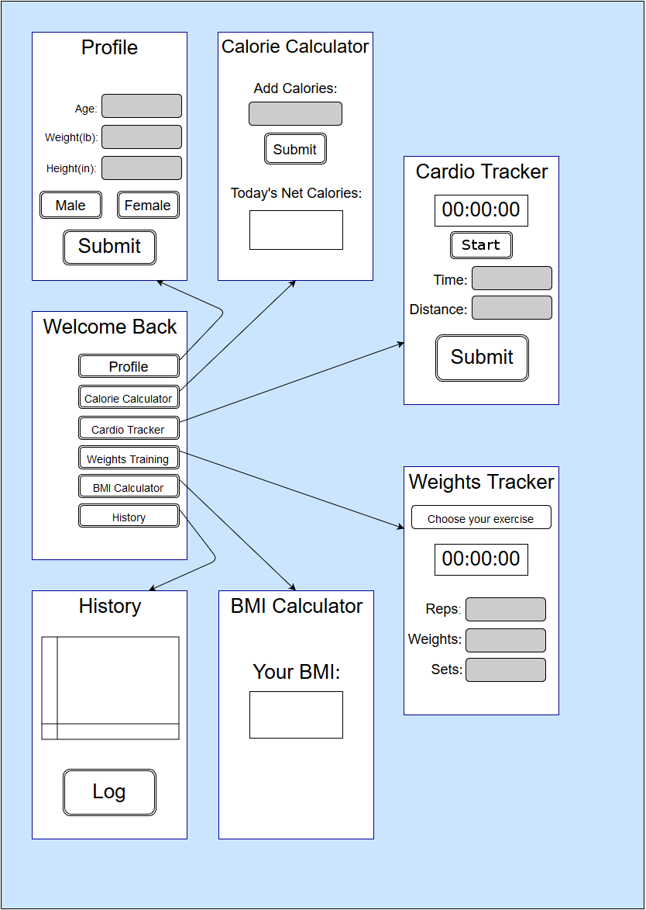

# Software Design Document
## for FitTigerLife
### Version 1.0 approved
### Prepared by *Robin Tallitsch, Triston Lamonte, Thomas Chang, Spencer Janin, Charlie Thistlethwaite, and Cort Fitzpatrick*
### *CSC 4330*
### *11/2/2016*

---

## Table of Contents

 * Table of Contents
 * [Revision History](#Revision)

1. [Introduction](#Introduction)
  * 1.1 [Purpose](#purpose)
  * 1.2 [Intended Audience](#intended-audience)
  * 1.3 [Scope](#scope)
2.	[System Architecture](#System-Arch)
  * 2.1	[Main Architecture](#Main)
  * 2.2	[Sub-System Architecture](#Sub)
        - 2.2.1 [Profile](#Profile)
        - 2.2.2 [Cardio Tracker](#Cardio)
        - 2.2.3 [Weights Tracker](#Weights)
        - 2.2.4 [Entry Tracker](#Entry)
        - 2.2.5 [Calorie Calculator](#Calorie)
        - 2.2.6 [Data Graphing](#Graphing)
        - 2.2.7 [Timer](#Timer)
        - 2.2.8 [BMI Calculator](#BMI)
3. [Application Views](#Views)
  * 3.1	[Development View](#Development)
  * 3.2	[Physical View](#Physical)
  * 3.3	[Database View](#Database)
  * 3.4	[Work-Assignment View](#Work-assignment)
4. [Element Catalog](#Element-Catalog)
5. [User Interfaces](#UI)
  * 5.1	[User Interface Description](#UI-Description)
  * 5.2	[User Interfaces Diagram](#UI-Diagram)

---

## Revision History 

| Name | Date | Reason for Change | Version |
| :--- | :--- | :--- | :--- |
| Robin Tallitsch, Triston Lamonte | 10/31/2016 | Initial | 1.0 |

---

# 1. Introduction 

### 1.1 Purpose
The purpose of the Software Design Document is to describe the implementation of the Fit Tiger Life application sufficiently to allow software development to proceed with a common understanding of how the application should be built.

### 1.2 Intended Audience
The primary audience for the Software Design Document are members of the Software development team.

### 1.3 Scope
Fit Tiger Life is a small and efficient exercise and diet application intended for android users who are looking for an application to help track their fitness progress similar to Couch to 5K and Google Fit. This application will be more focused on being efficient and easily accessible, whereas the other two you needed subscriptions or logins, this application will not. Much like other fitness applications, there will be common tools like a Calorie Calculator, and a Cardio Exercise Tracker that the intended user will be looking for in a fitness application.

---

# 2. System Architecture

### 2.1 Main Architecture

### 2.2 Sub-System Architecture

#### 2.2.1 Profile
The system accepts a positive numbers for the user’s age, height, weight, and a boolean to represent the user’s gender. If there is missing information, the submission process will pull the previously stored values in the profile database file as input.  If the user inputs invalid data, then the system will alert the user to use only positive numbers. When valid data in submitted to the system, the system will write to the profile database file and store the age, height, weight, and gender the user submitted, this will override the previous information stored in the profile.
* Rationale: The information stored by this system is necessary for several other systems in the application to function, but all the information is subject to change so we need to provide the user with the ability to override the previous information. We also do not want to burden our users by inputting all their information every time they want to update select items, so fields left blank by the user should retain the previously stored information.

#### 2.2.2 Cardio Tracker
The cardio tracker accepts time in the form hh:mm:ss as input along with a positive number representing distance, it also pulls the user’s weight from the profile. It is expected that time will be inputted from the timer, but the user may also manually input the time. Those three inputs are used to run the calories burned formula, and the calories calculated from that formula are subtracted from the net calories.
* Rationale: The application requires a method to subtract the calories the user has burned in addition to adding the calories consumed. To this end the cardio Tracker allows the user to easily calculate the calories they have burned with just the time they have jogged and the distance they have traveled.

#### 2.2.3 Weights Tracker
This system presents the user with a list of exercises to choose from, each of these exercises are linked to an entry in the exercises file in the database. When the user selects an exercise, the system will lookup the entry linked with that exercise and displays the relevant information to the user. The system will then wait for the user to input reps, weights, and sets. If the user inputs invalid information the system will alert the user to only use positive numbers. When the user submits valid input, the system will set the timer to the appropriate time for the selected exercise. If the amount the user has run this system reaches a point that could be a health concern the system will alert the user to rest and make sure to workout different muscles and not to over exert the same muscles through too much exercise.
* Rationale: The system is needed to instruct the user on weights training, this endeavor requires the information to be presented to the user, so accessing a database is an effective and scaleable solution for this requirement.

#### 2.2.4 Entry Tracker
This system accepts values from Profile, Calorie Calculator, Cardio Tracker, and Weights Tracker. Profile will send any its values any time it is updated. Calorie Calculator will send a positive integer for calories inputted, and a negative or positive integer for net calories. Cardio Tracker will send a positive value for time, a positive value for distance, and the updated net calories. Weights Tracker will send positive values for time, sets, weights, and reps.
The maximum amount of Entry Tracker dates shown to the user will be 100. 100 will also be the total number of saved Entries. These should be formatted to show the user’s information when the specific date is requested by the user in the Log section of History.
* Rationale: The application requires the user’s history to be stored, as such this system requires a lot of interaction from other systems, specifically when it comes to input. However, this can be used to differentiate which entry to make based on the input. It also means that this system will be easily scaled if addition systems need to be implemented.

#### 2.2.5 Calorie Calculator
This system accepts a positive integer as input from the user. Should the user input invalid data the system will alert them to use only positive whole numbers. When the system receives valid data, it will add the input to the net calories value stored in the calories file. After that the system will update the net calories displayed to the user.
* Rationale: In order for the user to track their calories, the application required a method for the user to store the calories they have consumed and that value has to be stored so that it can be called even after the application has been closed. For that reason adding the imputed value to a value stored in a file appeared to be the most efficient way to achieve that goal.

#### 2.2.6 Data Graphing
This system will search the log file for the net calories stored each day, then uses android studio’s onboard graph generation tools to plot net calories against time. This graph is generated when the user enters the history page.
* Rationale:  The application requires a method to visually display their history, this means this system is highly dependent of Entry Tracker. However because entry tracker writes to a file, Data graphing can be worked on before entry tracker is completed, by reading from a test file.

#### 2.2.7 Timer
Will be used in pair with the Cardio Tracker and Weights Tracker where the time will be shown in seconds, minutes, and hours. The Weights Tracker will utilize the timer as a countdown timer. When a countdown timer has been initialized, the inputted time will be converted into number of seconds and a loop will decrement the value by 1 until it reaches 0 seconds where this should also trigger a function to cue an auditory noise from the device. The Timer will not be allowed to receive a new initialization value until the exercise option has changed.
The Cardio tracker will utilize the timer as a count-up timer. When a count-up timer has been initialized it will start a loop at 0 and increment the value by 1 every second until stopped by the user. The original time will be converted into seconds saved as an integer value, then it will be sent to Entry Tracker.
* Rationale: This system is designed to be modular and can be implemented for various systems.

#### 2.2.8 BMI Calculator
This system pulls the double values for weight and height from the profile, runs the BMI equation of [703(weight/(height*height))] and outputs the result to the screen.
Rationale: Body Mass Index (BMI) was deemed necessary because users would deem it necessary from a fitness application. It was also made to be as unobtrusive as possible in the application since it is a simple formula. To make it more unobtrusive, the calculator does not store any data, rather just reads, calculates, and outputs.

---

# 3. External Interface Requirements

### 3.1 Development View
Fit Tiger Life will be developed using Android Studio 2.0, and coded in java. Android studio generates many files and directories in order to build an android studio project, but will not be touched by the developers. Aside from those files, the java file being developed will all be located in the same directory and the database is contained in the save directory as the java directory.

### 3.2 Physical View
The only hardware the Fit Tiger Life shall interact with is the user’s android phone. Besides running off the hardware the application will read and write to the phone’s local memory which may or may not be a separate storage item.

### 3.3 Database View
Fit Tiger Life does not rely on a server side database, all required information is stored locally to the user’s phone. The database directory contains the following files: a file to store information written by the profile system, a file to store the current calorie total for a day, a file that stores a list of exercise and the relevant information pertaining to each exercise to be read by exercise tracker, and a log of all the changes to the previously mentioned files.

### 3.4 Work-Assignment
Lead Development and Programming Team: Spencer, Thomas
Graphic Design and User Interface Design Team: Cort, Charles
Lead Documentation Team: Triston, Robin

Spencer: Project Manager, Co-Head Developer, Secondary Tester, Database Administrator
Thomas: Co-Head Developer, Technical Architect, Secondary Tester, System Administrator
Corte: Lead Graphics Design Specialist, Co-Head User Interface Designer, Secondary Tester
Charles: Co-Head User Interface Designer, Primary Tester, Crowdsourcing Lead
Triston: Co-Head Technical Writer, Tertiary Tester, Secondary Graphics Designer
Robin: Co-Head Technical Writer, Tertiary Tester, Secondary User Interface Designer

---

# 4. Element Catalog

---

# 5. User Interfaces

### 5.1 User Interface Description
* Home page: The main directory for the user to navigate the application. It contains six buttons labeled Profile, Calorie Calculator, Cardio Tracker, Weights Training, BMI  Calculator, and History each of which links to their respective functions.
* Profile: Contains data fields for the user to record their weight in pounds, height in inches, and age in years and labeled appropriately, along with two buttons, one labeled male and the other label female, and a submit button to record the input.
* Calorie Calculator: This page contains a single data field labeled “Add Calories”, a button under that field that adds the inputted number to calories total, and a box containing the net calorie gain for the day labeled “Today’s Net Calories”.
* Cardio Tracker: This page contains a timer with a stop/start button, a field labeled time and another field labeled distance, and a button labeled submit that subtracts calories from the calorie file after running the appropriate calculations.
* Weights Tracker: This page contains a dropdown menu that lists weight training exercises, selecting any of the exercises shall bring up instructions on how to properly execute that exercise and a timer, and three fields allow the user to input the number of reps, weight, and number of sets.
* BMI Calculator: This page contains a box displaying the BMI labeled Your BMI.
* History: This page contains a line graph generated based on calories over time and a button that bring up the data from entry tracking organized by date and time.

### 5.2 User Interfaces Diagram

---
