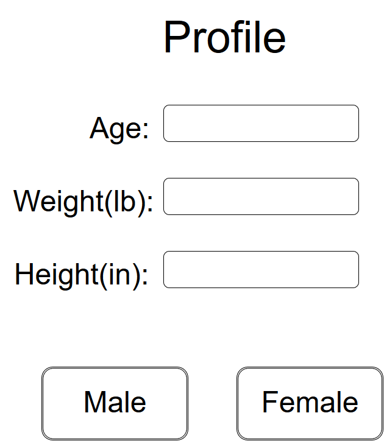

# Software Requirements Specification
## for FitTigerLife
### Version 1.0 approved
### Prepared by *Robin Tallitsch, Triston Lamonte, Thomas Chang, Spencer Janin, Charlie Thistlethwaite, and Cort Fitzpatrick*
### *CSC 4330*
### *10/20/2016*

---

## Table of Contents
 Table of Contents

Revision History

1. [Introduction](#Introduction)
  * 1.1 [Purpose](#purpose)
  * 1.2 [Document Conventions](#document-conventions)
  * 1.3 [Intended Audience and Reading Suggestions](#intended-audience-and-reading-suggestions)
  * 1.4 [Product Scope](#product-scope)
  * 1.5 [References](#references)
2.	[Overall Description](#overall-description)
  * 2.1	[Product Perspective](#product-perspective)
  * 2.2	[Product Functions](#product-functions)
  * 2.3	[User Classes and Characteristics](#product-perspective)
  * 2.4	[Operating Environment](#operating-environment)
  * 2.5	[Design and Implementation Constraints](#design-and-implementation-constraints)
  * 2.6	[User Documentation](#user-documentation)
  * 2.7	[Assumptions and Dependencies](#assumptions-and-dependencies)
3. [External Interface Requirements](#external-interface-requirements)
  * 3.1	[User Interfaces](#user-interfaces)
  * 3.2	[Hardware Interfaces](#hardware-interfaces)
  * 3.3	[Software Interfaces](#software-interfaces)
  * 3.4	[Communications Interfaces](#communications-interfaces)
4. [System Features](#system-features)
  * 4.1	[Profile](#system-feature-1)
  * 4.2	[Calorie Calculator](#system-feature-2)
  * 4.3	[Cardio Tracker](#system-feature-3)
  * 4.4	[Weights Tracker](#system-feature-4)
  * 4.5	[BMI Calculator](#system-feature-5)
  * 4.6	[Entry Tracking](#system-feature-6)
  * 4.7	[Data Graphing](#system-feature-7)
  * 4.8	[Timer](#system-feature-8)
5. [Other Nonfunctional Requirements](#other-nonfunctional-requirements)
  * 5.1	[Performance Requirements](#performance-requirements)
  * 5.2	[Safety Requirements](#safety-requirements)
  * 5.3	[Security Requirements](#security-requirements)
  * 5.4	[Software Quality Attributes](#software-quality-attributes)
  * 5.5	[Business Rules](#business-rules)
6. [Other Requirements](#other-requirements)
7. [Appendix](#appendix)
  * 7.1 [Glossary](#glossary)
  * 7.2 [Analysis Models](#analysis-models)
  * 7.3 [To Be Determined List](#to-be-determined-list)

---

## Revision History

| Name | Date | Reason for Change | Version |
| :--- | :--- | :--- | :--- |
| Robin Tallitsch, Triston Lamonte, Thomas Chang | 10/20/2016 | Initial | 1.0 |

---

## 1. Introduction 

#### 1.1 Purpose
The purpose of this document is to list and give detailed descriptions of the various requirements necessary for the “Fit Tiger Life” application. This document will also entail the development of the system as well as interface, system constraints, and interactions. This document covers the initial prototype of the application with no current revisions nor releases.

#### 1.2 Document Conventions
The documentation for this application follows IEEE Standard 830-1993 as a standard. Every requirement stated is to have it’s own priority as listed by the requirement itself. Any non-functional requirements will not list their priority, but instead inherit priority of the requirement it references to a lesser degree of the requirement.

#### 1.3 Intended Audience and Reading Suggestions
This SRS document is written to be used by developers and testers working on this project. The intended audience of this document should be familiar with Android interfaces and other Android applications so that the information from this SRS document is familiar to the reader. Any marketing staff should also be familiar with the requirements and specifications of the Google App Store that this application will be distributed on.
Reader is Suggested to read Sections 1 and 2 prior to any other sections as those sections will help the reader understand any document conventions and help understand the product’s goals before getting into the functionality of the application. testers should pay attention primarily to Section 4 when testing functionality, and use Sections 2 and 5 for judging if the current version is in line with the overall goal.

#### 1.4 Product Scope
Fit Tiger Life is a small and efficient exercise and diet application intended for android users who are looking for an application to help track their fitness progress similar to Couch to 5K and Google Fit. This application will be more focused on being efficient and easily accessible, whereas the other two you needed subscriptions or logins, this application will not. Much like other fitness applications, there will be common tools like a Calorie Calculator, and a Cardio Exercise Tracker that the intended user will be looking for in a fitness application.

#### 1.5 References
http://www.ibm.com/developerworks/rational/library/content/legacy/parttwo/1000/0670/0670_Schneider_Ch07.pdf Documenting Use Cases/ Schneider/ ver 1.0/ August 17th 2010/ IBM DevWorks

---

## 2. Overall Description

#### 2.1 Product Perspective
This application is building on the market made by Google Fit, FitBits, C25K, and other various fitness tools that have come about due to the self fitness boom over the past decade. The application itself is to be self contained unlike many other applications that are parts of bigger organizations. This application will help users who want an application quickly at their fingertips to where the user not have to sign up or sign in just to get the features the user wants.
#### 2.2 Product Function
**Profile** - Personal information to use for calculations

**Cardio Tracker** - Logs your distance and time of run

**Weights Tracker** - Logs weights for lifting and reps of each type of weight lifting

**Calorie Calculator**- Calculates calories burned per cardio session. calculates how many calories should be burned a day

**Entry Tracking** - Stores the information from Calorie Calculator, Weights Tracker, and Cardio Tracker by date and time

#### 2.3 User Classes and Characteristics
This application should only affect one overarching User Class of an Android User who will want a fitness app. Characteristics of the User class are that the user has experience with other applications based in the Android Operating System, will be looking for an easy accessible application dedicated to self fitness, and will be using the app on a daily or a near daily basis.
#### 2.4 Operating Environment
The operating environment for this application will be on Android mobile phones 7.0 and up where the application will be self-contained with no networking. Any input of data will come from the user. The application must be able to coexist with other applications.
#### 2.5 Design and Implementation Constraints
The most important constraint on the developing aspect is that the application will not have any networking or database implementation where any storage will be local. Local memory shall not exceed 500 Mb of total memory storage, otherwise there should be minimal memory requirements. The early version of this application will only be in English and moving to more languages is not in consideration at this moment. For implementing this application, it has to not interfere with other applications to where it runs in parallel with other applications.
#### 2.6 User Documentation
A key aspect of Fit Tiger Life is to be easily accessible so that all  User Interface should be easily recognizable and quickly understood specifically by Android users. Fit Tiger Life will stick to common conventions of [Android UI](https://developer.android.com/guide/topics/ui/index.html).
#### 2.7 Assumptions and Dependencies
Fit Tiger Life will have to save data locally so there is an assumption that there will be enough space on the device for this data. There is also an assumption that this application will qualify to be on the Google App Store.

---

## 3. External Interface Requirements

#### 3.1 User Interfaces
The first time the user opens the application, the user will be brought to the home screen and prompted to make a personal profile, provided they know the know the info being asked for in age, height, gender, and weight. Afterwards the user goes on and uses the application to their needs. If the user wishes to change the personal info at any time, they can by going to Profile (FR.1).
The main Page will have access to all parts of the application, and all parts of the application will have access to a Home button to where they can easily traverse all parts. The pathways between activities will be done primarily through the use of buttons for the user to tap and be brought to their destination. As of now there are no animations for any button presses.
For Users to insert their data, most spaces for them to do so are going to be empty fields to either input a number or a string of characters. When selecting from a certain set of answers, as in type of workout, there shall be primarily drop down boxes.

 

#### 3.2 Hardware Interfaces
The main hardware interface the app has to deal with is the screen size of the device. The minimum screen size the app will be developed for is 2.8 inches diagonal with an aspect ratio between 1.333 (4:3) and 1.779 (16:9). The application has one main interaction with the local storage of data on the device. Other hardware connections that happens within the application will be primarily taken care of by the underlying Operating System of the mobile phone.
#### 3.3 Software Interfaces
Essential interaction between this app and other software and tools on the device is limited to the native clock and date. The application will be compatible with Android OS 7.0 and up, so any software native to Android 7.0 installation should be compatible with Fit Tiger Life.
#### 3.4 Communications Interfaces
To prevent the application from having slow down issues, all functions on the application local to the user’s mobile device. The only data transfers that occur will be between the application and the hard drive of the device which will transfer data via Secure Shell transfers. The file formats for these data transfers are TBD with XML, ASCII, and HTML in consideration.

---

## 4. System Features

#### 4.1 Profile

| **Item (Priority)** | **Profile (9)** |
| :------- | :------------------------|
| **Description** | User enters in personal information for fields of height, age, weight, and gender, where these values will be later sent to Entry Tacking for storage. |
| **Stimulus/Response** | Values are changed by the user -> Send new values to Entry Tracker (FR.1.6)  |
| **Stimulus/Response** | Entry tracker asks for values -> Send values to Entry Tracker (FR.1.6)  |
| **Requirement 1** | Data fields for the user to record their weight in pounds, height in inches, and age in years by input from the keypad. If the user inputs any negative numbers or any non-numeric letter or symbol into any of these fields then the system shall report an error and instruct the user not to use negative numbers or non-numeric symbols. |
| **Requirement 2** | Two buttons, one labeled male and the other label female, that the user can select to record their gender. No other genders will be able to be selected. Upon one of these buttons being selected, the selected button shall have a blue outline, and if the other button was selected before, then that button’s outline will disappear. |
| **Requirement 3** | A button that, when pressed, replaces the previous stored profile information with the new information recorded by requirements one and two of Profile. If there are fields left blank then the pre-existing profile information shall not be replaced for those fields left blank. After the update to profile is complete, the profile is the sent to Entry Tracking to record the change in the history log. |

#### 4.2 Calorie Calculator

| **Item (Priority)** | **Calorie Calculator (6)** |
| :------- | :------------------------|
| **Description** |  Calculate calories consumed and calories burned. |
| **Stimulus/Response** | Cardio Tracker (FR.1.3) sends values to Calorie Calculator -> Computes calories burned during session and returns to Entry Tracker (FR.1.6) |
| **Stimulus/Response** | User input calories taken in for the day -> Takes this value along with data from Cardio Tracker (FR.1.3) to show net calories for the day |
| **Requirement 1** | A field for the user to record the calories they consumed from their meals from that day. The calorie calculator will then add that to the calorie total for that day by adding previous calories consumed that day, subtracting the calories burned recorded by the cardio tracker that day and subtracting the calories burned from metabolism calculated using height, weight, age, and gender. |
| **Requirement 2** | A display of the calories gained that day. The display represents a net calorie gained with positive numbers and represents a net calorie loss with negative numbers. |

#### 4.3 Cardio Tracker

| **Item (Priority)** | **Cardio Tracker (7)** |
| :------- | :------------------------|
| **Description** | Records total time of cardio session, style of activity, distance, then sends information to Calorie calculator to get calories burned. |
| **Stimulus/Response** | User inputs new values into fields -> This data is sent to Calorie Calculator (FR.1.2) as well as Entry Tracker (FR.1.6)|
| **Requirement 1** | A function to start and stop the timer feature to record how long a cardio exercise took and store that time for later reference. |
| **Requirement 2** | Two fields allows the user to input the distance they traveled and the time the exercise took. The time field is automatically filled by the timer once the timer has been stopped, the field is still editable. |
| **Requirement 3** | Once the fields are submitted Calories burned will be calculated from distance, time, and weight. |

#### 4.4 Weights Tracker

| **Item (Priority)** | **Weights Tracker (7)** |
| :------- | :------------------------|
| **Description** | User records type of weights exercise, as well as reps and sets for said exercise. |
| **Stimulus/Response** | User inputs new values into fields -> This data is sent to Entry Tracker (FR.1.6) |
| **Requirement 1** |  A dropdown menu that lists weight training exercises. Selecting any of the exercises shall bring up instructions on how to properly execute that exercise and a timer. |
| **Requirement 2** | Three fields allow the user to input the number of reps, weight and number of sets. These fields are to initiate at 0 and remain at zero unless changed by the user.  |
| **Requirement 3** | Once the timer has been started it shall count down until it reaches zero. Weights tracker shall make an auditory alert letting the user know when to change to the next section of the exercise and reset the timer where it will be set up for the next set of instructions. |

#### 4.5 BMI Calculator

| **Item (Priority)** | **BMI Calculator (7)** |
| :------- | :------------------------|
| **Description** | Put in variables for the calculator based on personal profile statistics. |
| **Stimulus/Response** | User requests calculation -> Calculates the user’s BMI based on data from Profile (FR.1.1) and shows it to the user |
| **Requirement 1** | BMI will be calculated based on the weight and height from the profile and displayed to the user. The calculation shall not be stored. |

#### 4.6 Entry Tracking

| **Item (Priority)** | **Entry Tracking (8)** |
| :------- | :------------------------|
| **Description** | Receives data from Calorie Calculator, Cardio Tracker, Weights Tracker, and Profile and stores it as a session with information of the date and time. |
| **Stimulus/Response** | User submits information into Cardio Tracker (FR.1.3) and Calorie Calculator (FR.1.2) -> Locally save values from each in a session noted by date and time |
| **Stimulus/Response** | User submits information into Weights Tracker (FR.1.4) -> Weights Tracker (FR.1.4) submits values and initializes Timer (FR.1.8) to submit a value. Locally saves values from each into a session noted by date and time |
| **Requirement 1** |  Entry tracking stores the changes to profile, calories consumed from calorie calculator, calories burned from cardio tracker, and exercises completed from weights tracker and organizes that data by date and time.  |
| **Requirement 2** | Will store up to 100 sessions based on date and time. If system attempts to save another session, the oldest date and timed session will be deleted to allocate a place for the newest submission of a session. |

#### 4.7 Data Graphing

| **Item (Priority)** | **Data Graphing (6)** |
| :------- | :------------------------|
| **Description** | Takes data from Calorie Calculator, Cardio Tracker, Weights Tracker, and Profile. Will display different graphs based on data received. |
| **Stimulus/Response** | User initiates the graphing sequence -> System fully generates a line graph for calories over time from Entry Tracker (FR.1.6) information  |
| **Requirement 1** | A line graph generated from calories gained over time stored by Entry tracking.  |

#### 4.8 Timer

| **Item (Priority)** | **Timer (2)** |
| :------- | :------------------------|
| **Description** | Will have capability of count-up timer and countdown timer.  |
| **Stimulus/Response** | User initiates a countdown timer -> Timer counts down to 0 and issues an auditory cue |
| **Stimulus/Response** | User initiates a count-up timer -> Timer counts up until user stops the timer. Value is then sent to Entry Tracker (FR.1.6) |
| **Requirement 1** | Timer will count up until stopped by user. |
| **Requirement 2** | Timer can be set a specific time, it will then count down until it reaches zero. When the timer reaches zero, an auditory cue will sound. |

---

## 5. Other Nonfunctional Requirements

#### 5.1 Performance Requirements
The application needs to open and run within 3 seconds. Functions must start operating within 0.2 seconds of being requested by the user. Timer must be running when in use whether it be in the foreground or background. Graphs must be fully created before viewable by the user.
#### 5.2 Safety Requirements
There will be generic safety requirements built into the system. The user will be advised to rest if the exercising session goes for an abnormal length of time. The user shall get updates at various integrals to advise the user to cease their workout if the inhibit abnormal pains or soreness. The system will also alert the user at various times to be alert of their surroundings when doing do the cardio exercises.
#### 5.3 Security Requirements
Personal Information is up to the user to stay secure. No critical information will be stored in the application or on the device unless the user willingly inputs it. Any security or privacy certifications will be in parallel with the Google App Store.
#### 5.4 Software Quality Attributes
**Fast**- The product should be as responsive to the user’s input as possible. Once a user interacts with a feature, the application should respond with the appropriate response in the shortest time possible.

**Easy to use**- The interface is simple and easy for the user to understand how to use the product with minimal confusion.  How the user should interact with each feature of the product should be self evident and immediately doable.

**Streamlined**- The number of interactions the user is required to make with the application in order to achieve the desired response should be as minimal as possible. There should be the fewest possible delays before the user can start using the product.
#### 5.5 Business Rules
This application should only be used for legal means, and unless otherwise instigated by the user, the native nature of this application will remain completely legal. As long as the means remain legal, then the user is allowed to use the application however the user wishes it to be used.

---

## 6. Other Requirements

---

## 7. Appendix

#### 7.1 Glossary
IEEE - Institute of Electrical and Electronics Engineers

BMI - Body Mass Index

#### 7.2 Analysis Models
N/A

#### 7.3 To Be Determined List
(3.4) File formats were not given strong enough consideration to narrow down which will be primarily used.
